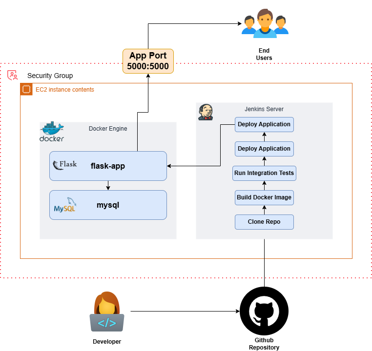
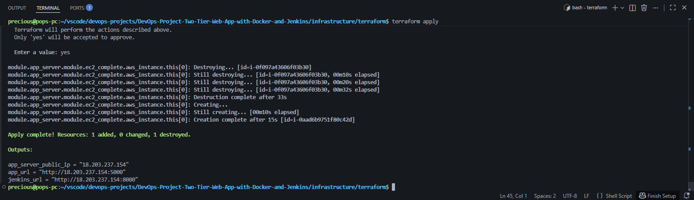
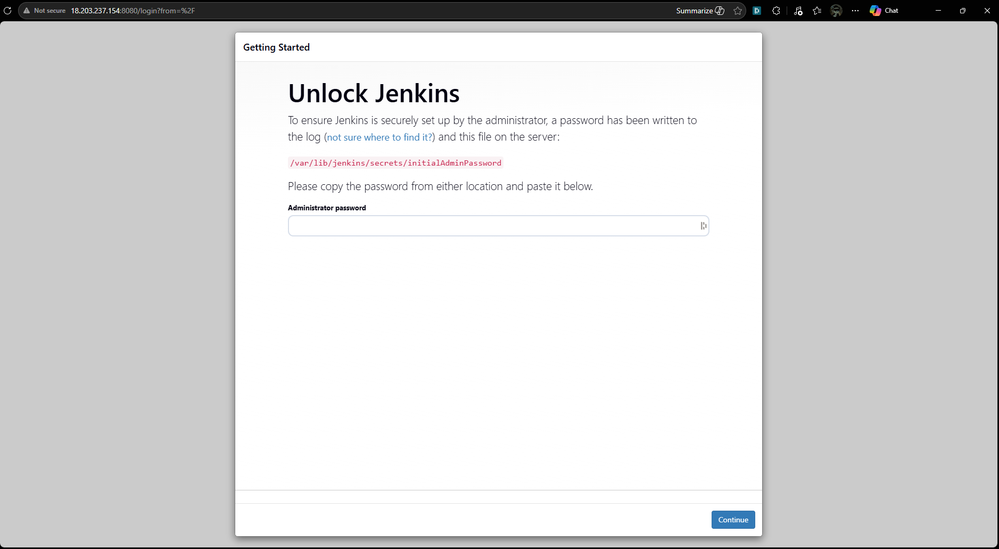
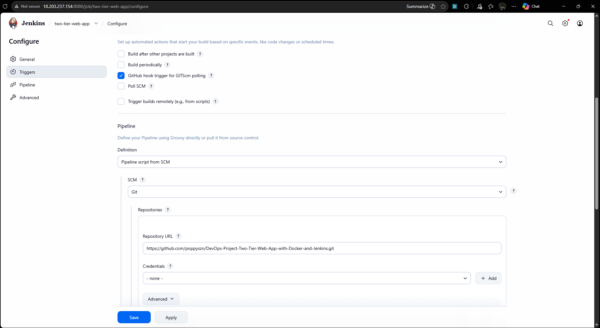
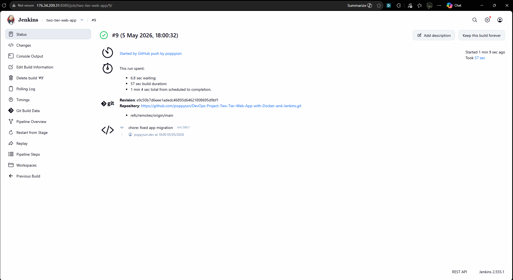
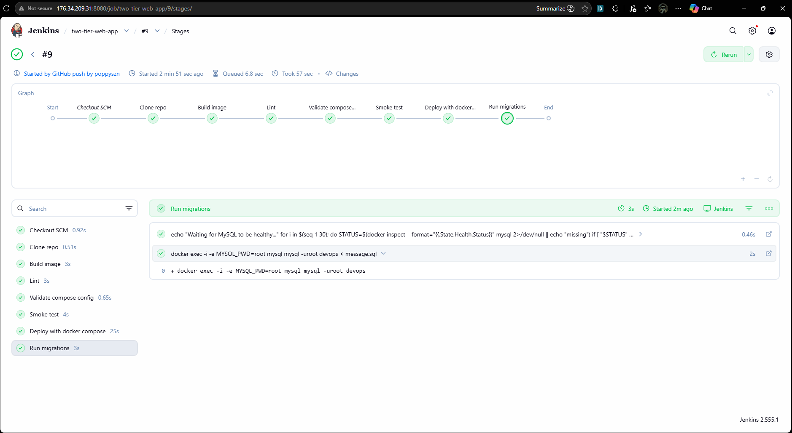
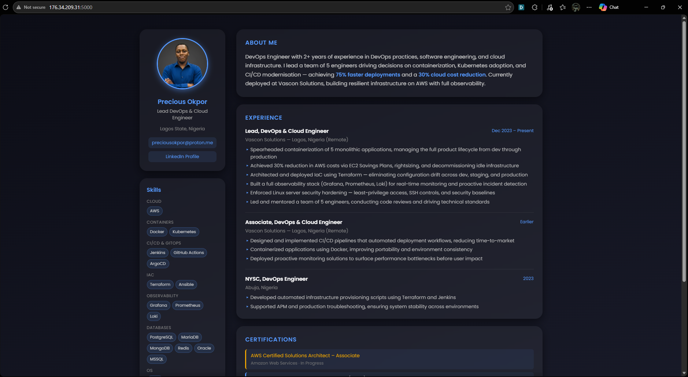

# DevOps Project: Automated CI/CD Pipeline for a 2-Tier Flask Application on AWS

**Author:** Precious Okpor  
**GitHub:** [poppyszn](https://github.com/poppyszn)  
**Date:** May 2025

---

## Table of Contents

- [Project Overview](#project-overview)
- [Architecture](#architecture)
- [Tech Stack](#tech-stack)
- [Project Structure](#project-structure)
- [Step 1: Infrastructure Provisioning with Terraform](#step-1-infrastructure-provisioning-with-terraform)
- [Step 2: Server Setup](#step-2-server-setup)
- [Step 3: Jenkins Setup](#step-3-jenkins-setup)
- [Step 4: GitHub Webhook for Automatic Triggers](#step-4-github-webhook-for-automatic-triggers)
- [Step 5: Repository Structure](#step-5-repository-structure)
- [Step 6: Jenkins Pipeline](#step-6-jenkins-pipeline)
- [Step 7: Running the Application](#step-7-running-the-application)
- [Conclusion](#conclusion)

---

## Project Overview

This project demonstrates the end-to-end deployment of a 2-tier web application (Flask + MySQL) on AWS EC2. The application is containerized with Docker and orchestrated with Docker Compose. A fully automated CI/CD pipeline is built with Jenkins — triggered automatically on every push to the `main` branch via a GitHub webhook — covering build, lint, validation, smoke testing, database migration, and deployment.

A personal portfolio page is served as the app's frontend, dynamically pulling messages from a MySQL database and allowing visitors to leave guestbook entries.

---

## Architecture

```
+----------------+      +----------------------+      +---------------------------+
|   Developer    |----->|     GitHub (main)    |----->|      Jenkins Server       |
| (git push)     |      |  Source Code + IaC   |      |       (AWS EC2)           |
+----------------+      +-------+------+-------+      |                           |
                                |      |               | 1. Clone repo             |
                         Webhook|      |               | 2. Build Docker image     |
                                +----->+               | 3. Lint (flake8)          |
                                                       | 4. Validate compose       |
                                                       | 5. Smoke test             |
                                                       | 6. Run DB migrations      |
                                                       | 7. Deploy (compose up)    |
                                                       +-------------+-------------+
                                                                     |
                                                                     v
                                                       +---------------------------+
                                                       |     Application Server    |
                                                       |        (AWS EC2)          |
                                                       |                           |
                                                       | +-----------------------+ |
                                                       | | Flask Container :5000 | |
                                                       | +-----------+-----------+ |
                                                       |             |             |
                                                       |             v             |
                                                       | +-----------------------+ |
                                                       | |   MySQL Container     | |
                                                       | +-----------------------+ |
                                                       +---------------------------+
```



---

## Tech Stack

| Layer | Technology |
|---|---|
| Application | Python 3.9, Flask 2.0, Flask-MySQLdb |
| Database | MySQL |
| Containerization | Docker, Docker Compose |
| CI/CD | Jenkins (Pipeline as Code) |
| Infrastructure | AWS EC2, Terraform |
| Code Quality | flake8 |
| OS | Ubuntu (Debian Bullseye) |

---

## Project Structure

```
.
├── app.py                        # Flask application
├── requirement.txt               # Python dependencies
├── message.sql                   # Database schema migration
├── Dockerfile                    # Container build definition
├── docker-compose.yml            # Multi-container orchestration
├── Jenkinsfile                   # CI/CD pipeline definition
├── templates/
│   └── index.html                # Portfolio + guestbook frontend
├── static/
│   └── pfp.png                   # Profile picture
├── diagrams/                     # Architecture and workflow diagrams
└── infrastructure/
    └── terraform/                # AWS infrastructure as code
        ├── main.tf
        ├── variables.tf
        ├── outputs.tf
        ├── providers.tf
        ├── terraform.tfvars.example
        ├── modules/
        │   ├── ec2/
        │   ├── vpc/
        │   └── security_groups/
        └── scripts/
            └── init_script.sh    # EC2 user-data bootstrap
```

---

## Step 1: Infrastructure Provisioning with Terraform

The EC2 instance is provisioned using Terraform with a modular structure under `infrastructure/terraform/`.

**1. Copy and fill in your variables:**
```bash
cd infrastructure/terraform
cp terraform.tfvars.example terraform.tfvars
# Edit terraform.tfvars with your AMI ID, key pair path, and region
```

**2. Initialise and apply:**
```bash
terraform init
terraform plan
terraform apply
```

**3. Outputs after apply:**



```
app_server_public_ip = "<your-ec2-ip>"
app_url              = "http://<your-ec2-ip>:5000"
jenkins_url          = "http://<your-ec2-ip>:8080"
```

The EC2 instance runs `scripts/init_script.sh` as user-data on first boot, automatically installing Docker and Jenkins — no manual setup required.

**Security group inbound rules provisioned:**

| Port | Protocol | Purpose |
|---|---|---|
| 22 | TCP | SSH access |
| 5000 | TCP | Flask application |
| 8080 | TCP | Jenkins UI |

---

## Step 2: Server Setup

If provisioned via Terraform, the init script handles everything automatically. For manual setup:

**Connect to the instance:**
```bash
ssh -i /path/to/key.pem ubuntu@<ec2-public-ip>
```

**Install Docker:**
```bash
sudo apt-get update -y
sudo apt-get install -y ca-certificates curl gnupg
sudo apt-get install -y docker-ce docker-ce-cli containerd.io docker-buildx-plugin docker-compose-plugin
sudo systemctl enable docker && sudo systemctl start docker
sudo usermod -aG docker $USER
```

---

## Step 3: Jenkins Setup

Jenkins is installed automatically via the init script. For manual setup:

```bash
# Install Java
sudo apt-get install -y fontconfig openjdk-21-jre

# Add Jenkins repo and install
wget -O /etc/apt/keyrings/jenkins-keyring.asc \
  https://pkg.jenkins.io/debian-stable/jenkins.io-2026.key
echo "deb [signed-by=/etc/apt/keyrings/jenkins-keyring.asc] https://pkg.jenkins.io/debian-stable binary/" \
  | sudo tee /etc/apt/sources.list.d/jenkins.list > /dev/null
sudo apt-get update && sudo apt-get install -y jenkins
sudo systemctl enable jenkins && sudo systemctl start jenkins

# Grant Jenkins access to Docker — restart is required for the group change to take effect
sudo usermod -aG docker jenkins
sudo systemctl restart jenkins
```

**Get the initial admin password:**
```bash
sudo cat /var/lib/jenkins/secrets/initialAdminPassword
```

Access the dashboard at `http://<ec2-public-ip>:8080`, paste the password, install suggested plugins, and create an admin user.



---

## Step 4: GitHub Webhook for Automatic Triggers

A GitHub webhook tells GitHub to notify Jenkins every time code is pushed to the repository, triggering the pipeline automatically without needing to click **Build Now**.

### 4.1 — Enable the GitHub plugin in Jenkins

1. Go to **Manage Jenkins** → **Manage Plugins** → **Available**
2. Search for **GitHub Integration Plugin** and install it
3. Restart Jenkins if prompted

### 4.2 — Configure the Jenkins job to accept webhooks

1. Open your pipeline job → **Configure**
2. Under **Build Triggers**, check **GitHub hook trigger for GITScm polling**
3. Save

### 4.3 — Add the webhook in GitHub

1. Go to your GitHub repository → **Settings** → **Webhooks** → **Add webhook**
2. Fill in the fields:

| Field | Value |
|---|---|
| **Payload URL** | `http://<your-jenkins-ec2-ip>:8080/github-webhook/` |
| **Content type** | `application/json` |
| **Which events** | Just the push event |
| **Active** | Checked |

3. Click **Add webhook**

> **Note:** Your Jenkins server must be publicly accessible (port 8080 open) for GitHub to reach it. The trailing slash in `/github-webhook/` is required.

### 4.4 — Verify

Push a commit to `main`. GitHub will send a POST to Jenkins, which will appear as a green tick next to the webhook in GitHub → Settings → Webhooks. Jenkins should start a new build automatically within seconds.

---

## Step 5: Repository Structure

### Dockerfile

```dockerfile
FROM python:3.9-slim-bullseye

WORKDIR /app

RUN apt-get update && apt-get install -y gcc default-libmysqlclient-dev pkg-config && \
    rm -rf /var/lib/apt/lists/*

COPY requirement.txt requirement.txt

RUN pip3 install --no-cache-dir -r requirement.txt

COPY . .

EXPOSE 5000

CMD [ "python3", "-m", "flask", "run", "--host=0.0.0.0"]
```

`requirement.txt` is copied before the app code so Docker's layer cache skips the pip install step on code-only changes.

### docker-compose.yml

```yaml
services:
  mysql:
    container_name: mysql
    image: mysql
    environment:
      MYSQL_ROOT_PASSWORD: "root"
      MYSQL_DATABASE: "devops"
    ports:
      - "3306:3306"
    volumes:
      - mysql_data:/var/lib/mysql
    networks:
      - two-tier-nt
    restart: always
    healthcheck:
      test: ["CMD", "mysqladmin", "ping", "-h", "localhost", "-uroot", "-proot"]
      interval: 10s
      timeout: 5s
      retries: 5
      start_period: 60s

  flask-app:
    container_name: two-tier-app
    build:
      context: .
    ports:
      - "5000:5000"
    environment:
      - MYSQL_HOST=mysql
      - MYSQL_USER=root
      - MYSQL_PASSWORD=root
      - MYSQL_DB=devops
    networks:
      - two-tier-nt
    depends_on:
      mysql:
        condition: service_healthy

volumes:
  mysql_data:

networks:
  two-tier-nt:
```

### Database Schema (message.sql)

```sql
CREATE TABLE IF NOT EXISTS messages (
    id INT AUTO_INCREMENT PRIMARY KEY,
    message TEXT
);
```

The schema is applied by the Jenkins pipeline after deployment — not at app startup. Using `IF NOT EXISTS` makes the migration idempotent so it is safe to run on every deploy.

---

## Step 6: Jenkins Pipeline

The pipeline is defined in `Jenkinsfile` as code and runs seven stages in sequence:

```
Clone repo → Build image → Lint → Validate compose → Smoke test → Run migrations → Deploy
```

### Pipeline Stages

| Stage | What it does |
|---|---|
| **Clone repo** | Pulls latest code from the GitHub `main` branch |
| **Build image** | Builds the `flask-app` Docker image |
| **Lint** | Runs `flake8` inside the built image to catch syntax and style errors |
| **Validate compose config** | Validates `docker-compose.yml` is well-formed before deploy |
| **Smoke test** | Starts Flask in isolation and verifies it serves HTTP (no DB required) |
| **Run migrations** | Waits for MySQL to pass its healthcheck, then applies `message.sql` |
| **Deploy** | Tears down existing containers and brings up the full stack |

```groovy
pipeline{
    agent any
    stages{
        stage('Clone repo'){
            steps{
                git branch: 'main', url: 'https://github.com/poppyszn/DevOps-Project-Two-Tier-Web-App-with-Docker-and-Jenkins.git'
            }
        }
        stage('Build image'){
            steps{
                sh 'docker build -t flask-app .'
            }
        }
        stage('Lint'){
            steps{
                sh 'docker run --rm flask-app sh -c "pip install flake8 -q && flake8 app.py --max-line-length=120"'
            }
        }
        stage('Validate compose config'){
            steps{
                sh 'docker compose config -q'
            }
        }
        stage('Smoke test'){
            steps{
                sh 'docker run -d --name smoke-test -p 5001:5000 -e MYSQL_HOST=none -e MYSQL_USER=none -e MYSQL_PASSWORD=none -e MYSQL_DB=none flask-app'
                sh 'sleep 3'
                sh 'curl -sf http://localhost:5001 || curl -s -o /dev/null -w "%{http_code}" http://localhost:5001 | grep -qv 000'
            }
            post{
                always{
                    sh 'docker rm -f smoke-test || true'
                }
            }
        }
        stage('Run migrations'){
            steps{
                sh '''
                    echo "Waiting for MySQL to be healthy..."
                    for i in $(seq 1 30); do
                        STATUS=$(docker inspect --format="{{.State.Health.Status}}" mysql 2>/dev/null || echo "missing")
                        if [ "$STATUS" = "healthy" ]; then
                            echo "MySQL is healthy."
                            break
                        fi
                        echo "  attempt $i/30 - status: $STATUS"
                        sleep 3
                        if [ "$i" = "30" ]; then
                            echo "MySQL did not become healthy in time."
                            exit 1
                        fi
                    done
                '''
                sh 'docker exec -i mysql mysql -uroot -proot devops < message.sql'
            }
        }
        stage('Deploy with docker compose'){
            steps{
                sh 'docker compose down || true'
                sh 'docker compose up -d --build'
            }
        }
    }
}
```

**Create the pipeline job in Jenkins:**
1. Dashboard → **New Item** → **Pipeline** → OK
2. Pipeline section → Definition: **Pipeline script from SCM**
3. SCM: **Git** → enter the repository URL
4. Script Path: `Jenkinsfile`
5. Under **Build Triggers** → check **GitHub hook trigger for GITScm polling**
6. Save



Once the pipeline runs successfully:





---

## Step 7: Running the Application

**Verify running containers:**
```bash
docker ps
```

**Access the app:**
- Flask application (portfolio + guestbook): `http://<ec2-public-ip>:5000`
- Jenkins dashboard: `http://<ec2-public-ip>:8080`

**Check logs:**
```bash
docker logs two-tier-app
docker logs mysql
```



---

## Conclusion

The pipeline is fully automated — any `git push` to `main` triggers Jenkins via the GitHub webhook to build, test, migrate, and redeploy with zero manual intervention. The infrastructure is fully reproducible via Terraform, and server bootstrapping is handled by a user-data script, making the entire stack deployable from scratch with a single `terraform apply`.
